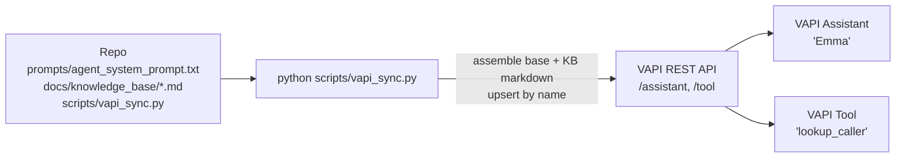
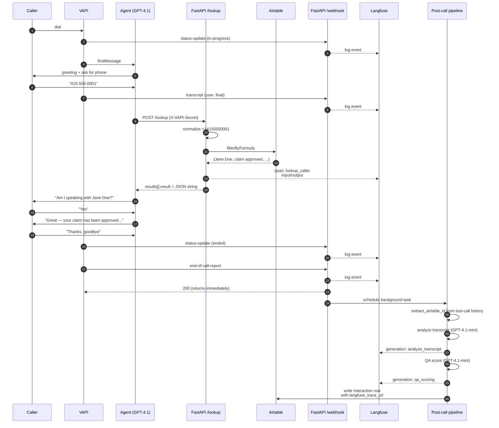
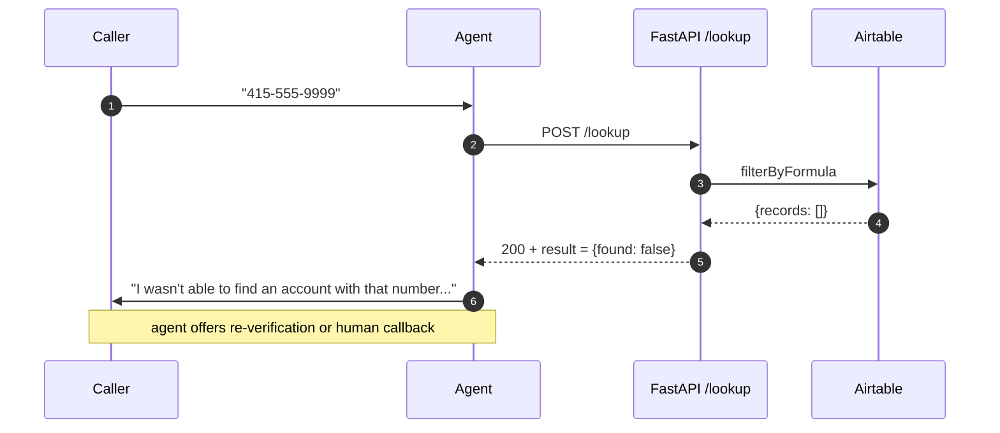

# Architecture

Every architectural element below maps to a specific file/line range in the repo. Citations like `api/services/analysis.py:28-103` are absolute and verifiable against the source.

## System overview

### Component → code map

| Element in diagram | Implemented in | Notes |
|---|---|---|
| **VAPI Native US Phone Number** | Configured in VAPI dashboard, not in code | Number assignment is a one-time UI step (`scripts/vapi_sync.py:239-240`) |
| **VAPI Voice Orchestrator** | Assistant config defined at `scripts/vapi_sync.py:101-170` | Synced to VAPI via REST API in `scripts/vapi_sync.py:218-241` |
| **Deepgram Nova-3 STT** | `scripts/vapi_sync.py:126-130` (`provider: "deepgram"`, `model: "nova-3"`) | Configured on the VAPI assistant |
| **GPT-4.1 Agent Brain** | `scripts/vapi_sync.py:109-115` (`provider: "openai"`, `model: "gpt-4.1"`, `temperature: 0.3`) | |
| **ElevenLabs Flash v2.5 TTS** | `scripts/vapi_sync.py:116-125` (`provider: "11labs"`, `model: "eleven_flash_v2_5"`, voiceId `21m00Tcm4TlvDq8ikWAM` = Rachel) | |
| **POST /lookup** (mid-call tool) | `api/routers/lookup.py:26-74` (the handler) | Request model: `VAPIToolCallRequest` (`api/models/tool_call.py:45-48`) |
| **POST /webhook** (live events + end-of-call) | `api/routers/webhook.py:23-51` | Request model: `VAPIWebhookPayload` (`api/models/webhook.py:58-61`) |
| **Post-call Pipeline (BackgroundTask)** | Scheduled at `api/routers/webhook.py:48` (`background_tasks.add_task(...)`); body at `api/services/analysis.py:28-103` | |
| **Transcript Analysis (GPT-4.1-mini)** | `api/services/analysis.py:106-116` — model literal at line 108 | Prompt loaded from `prompts/analysis_prompt.txt` via `api/utils/prompts.py:7-9` |
| **QA Scorer (GPT-4.1-mini)** | `api/services/qa_scorer.py:72-85` — model literal at line 75 | 9-item rubric at lines 17-63 |
| **Airtable callers + interactions** | Read: `api/services/airtable.py:29-44` (`get_caller_by_phone`) Write: `api/services/airtable.py:47-76` (`write_interaction`) | Models: `api/models/caller.py:10-39`, `api/models/interaction.py:10-28` |
| **Langfuse (per-call waterfall trace)** | All in `api/services/langfuse_client.py` — `trace_pipeline` (lines 132-151), `trace_lookup` (lines 154-176), `log_call_event` (lines 179-198) | Single trace ID derived per call at lines 91-92 |
| **Resend email alerts** | `api/services/email_alert.py:13-55` — fired from `api/services/analysis.py:87-102` | |

Legend: solid arrows = synchronous call/write; dotted arrows = observability or conditional alert. Every observation tagged with the same `session_id = call_id` collapses into one Langfuse trace per call (mechanism: OTel parent-context at `api/services/langfuse_client.py:103-110`).

## Infrastructure-as-Code: how the VAPI config gets to VAPI

| Step | Code |
|---|---|
| Read base prompt | `scripts/vapi_sync.py:51` (`PROMPT_PATH.read_text(...)`) |
| Concatenate KB markdown | `scripts/vapi_sync.py:46-61` (`assemble_system_prompt`) — iterates `KB_FILES` list at lines 38-43 |
| Build tool config | `scripts/vapi_sync.py:64-98` (`build_tool_config`) — `async: False` at line 72 |
| Build assistant config | `scripts/vapi_sync.py:101-170` (`build_assistant_config`) |
| Upsert tool (PATCH if name matches, else POST) | `scripts/vapi_sync.py:173-187` (`upsert_tool`); strips `type` on PATCH at line 179 |
| Upsert assistant | `scripts/vapi_sync.py:190-202` (`upsert_assistant`) |

Idempotent. Run it after every prompt change to push the new system prompt to VAPI.

## Happy-path call sequence

**Authentication note:** between the `/lookup` response and "Am I speaking with Jane Doe?", the agent actually performs a two-factor knowledge challenge — caller is asked to confirm their full name AND date of birth, and both must match the stored record before any claim information is disclosed. The agent never reveals stored values pre-verification. Full details in the AUTHENTICATION FLOW section of `prompts/agent_system_prompt.txt`. The `date_of_birth` field is at `api/models/caller.py:32-34` and is returned by `/lookup` at `api/routers/lookup.py:115`.

### Sequence → code map

| Step in diagram | Code |
|---|---|
| Webhook auth (each VAPI → H arrow) | `api/routers/webhook.py:29-33` calls `verify_vapi_secret` at `api/utils/auth.py:9-13` |
| Log event to Langfuse | `api/routers/webhook.py:38-39` calls `log_call_event` at `api/services/langfuse_client.py:179-198` |
| `POST /lookup` auth | `api/routers/lookup.py:31-35` |
| Phone normalize +14155550001 | `api/routers/lookup.py:83` calls `normalize_phone` at `api/utils/phone.py:9-28` |
| Airtable filterByFormula | `api/services/airtable.py:33-40` |
| `results[].result = JSON string` | `api/routers/lookup.py:54-57` — `json.dumps(result_dict)` at line 56 |
| Schedule background task | `api/routers/webhook.py:48` (`background_tasks.add_task(analysis.run_post_call_pipeline, event)`) |
| `extract_airtable_id` | `api/services/analysis.py:139-161` — walks `event.call.messages` reversed |
| `analyze_transcript` (GPT-4.1-mini) | `api/services/analysis.py:106-116` |
| `score_call` (GPT-4.1-mini) | `api/services/qa_scorer.py:72-85` |
| Write interaction row | `api/services/airtable.py:47-76` — `typecast: True` at line 73 |

## Error path — caller not found

The `/lookup` endpoint always returns 200 (`api/routers/lookup.py:74`). Per-call failures surface as `{"found": false, ...}` inside the `result` payload at these specific code paths:

| Failure | Source |
|---|---|
| Missing phone arg | `api/routers/lookup.py:78-80` |
| Invalid phone format | `api/routers/lookup.py:82-86` (catches `InvalidPhoneNumber` from `api/utils/phone.py:5-6, 26-28`) |
| Airtable unavailable | `api/routers/lookup.py:89-93` |
| Caller not found in Airtable | `api/routers/lookup.py:95-97` (returns `{"found": False}` only — no error field) |

The agent's branching prompt (`prompts/agent_system_prompt.txt`) checks the `found` and `error` fields and chooses the right response.

## Monitoring touchpoints

| Where | What is captured | Source |
|---|---|---|
| Railway logs | uvicorn access log + structured app logs at INFO | Logging config: `api/main.py:28-31`; per-module loggers at `api/routers/webhook.py:18`, `api/routers/lookup.py:21`, `api/services/analysis.py:25`, `api/services/langfuse_client.py:30` |
| Langfuse (one trace per call) | Live webhook events, `lookup_caller` span (input + output), post-call pipeline span with two child generations (analyze_transcript, qa_scoring) with input/output/model/latency/token usage | Trace creation: `api/services/langfuse_client.py:132-198`. Auto-instrumentation of OpenAI calls via `langfuse.openai.AsyncOpenAI` returned by `get_openai_client` at lines 76-88 |
| Airtable `interactions` | transcript, summary, sentiment, qa_score, qa_breakdown (JSON), topics_mentioned, escalated, caller link, langfuse_trace_url | Schema: `scripts/setup_airtable_schema.py`; write: `api/services/airtable.py:47-76`; model: `api/models/interaction.py:10-28` |
| Email alerts (Resend) | low-QA-score (< 0.6) or negative-sentiment calls — subject + HTML body include caller name, QA score, summary, Langfuse link | Trigger: `api/services/analysis.py:87-102`; send: `api/services/email_alert.py:13-55`; severity threshold (HIGH < 0.5) at `api/services/email_alert.py:10` |
| `scripts/inspect_call.py` | Manual diagnostic. Given a `call_id`, fetches `/call/{id}` from VAPI's REST API and dumps assistant config, message thread, every tool call with its actual result, and the transcript. | Lines 129-162 (`inspect`) |

## Error capture points

| Boundary | Failure mode | Behavior | Source |
|---|---|---|---|
| `/webhook` | Missing/wrong `X-VAPI-Secret` | 401, no work done | `api/routers/webhook.py:29-33` |
| `/webhook` | Malformed payload (Pydantic validation) | 422, no work done | FastAPI automatic via `VAPIWebhookPayload` annotation at `api/routers/webhook.py:25` |
| `/webhook` | Unknown event type | 200 with `{"status": "logged", "type": ...}`, no pipeline triggered | `api/routers/webhook.py:51` (only `end-of-call-report` triggers pipeline at line 48) |
| `/lookup` | Missing/wrong `X-VAPI-Secret` | 401, no work done | `api/routers/lookup.py:31-35` |
| `/lookup` | Missing phone arg | 200 with `{found: false, error: "missing phone argument"}` | `api/routers/lookup.py:78-80` |
| `/lookup` | Invalid phone format | 200 with `{found: false, error: "expected a 10-digit..."}` | `api/routers/lookup.py:82-86` |
| `/lookup` | Airtable failure | 200 with `{found: false, error: "lookup service unavailable"}`; full exception logged via `logger.exception` | `api/routers/lookup.py:89-93` |
| Post-call pipeline | LLM call failure | logged with `logger.exception`, pipeline aborted (no partial Airtable write) | `api/services/analysis.py:60-62` |
| Post-call pipeline | Airtable write failure | logged, pipeline continues to email step | `api/services/analysis.py:84-85` |
| Post-call pipeline | Email send failure | logged, swallowed (alerts are best-effort) | `api/services/analysis.py:101-102` |
| Langfuse layer | Any SDK error | swallowed via `contextlib.suppress(Exception)` in `_flush` (lines 118-120) and `_set_call_trace_metadata` (lines 123-129); outer `try/except` in `log_call_event` (lines 194-195) | `api/services/langfuse_client.py` |
