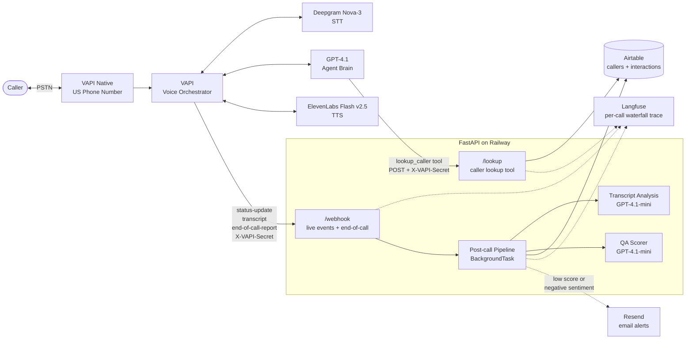
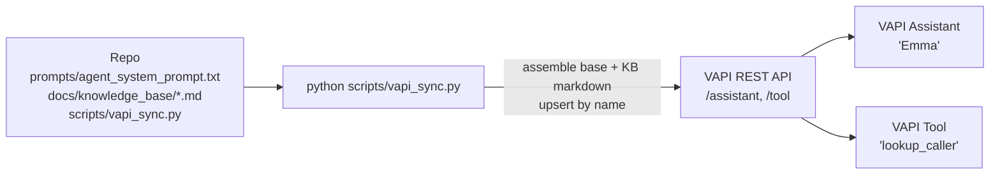
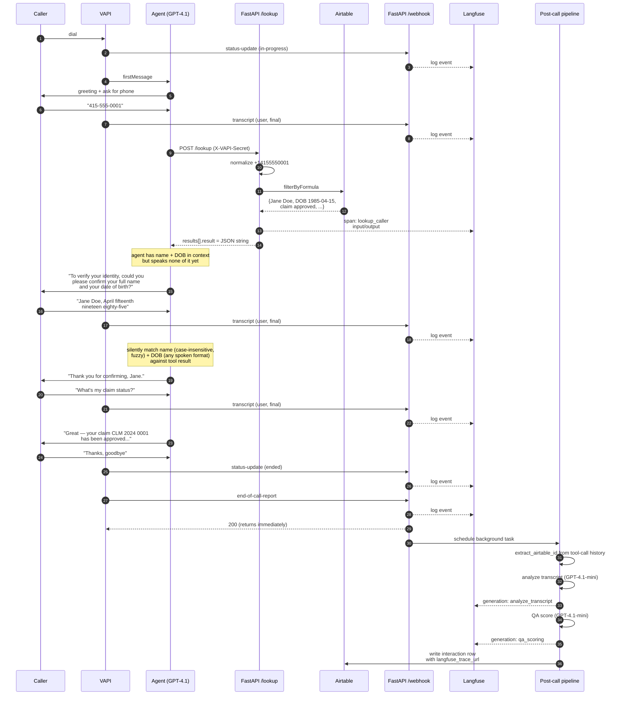
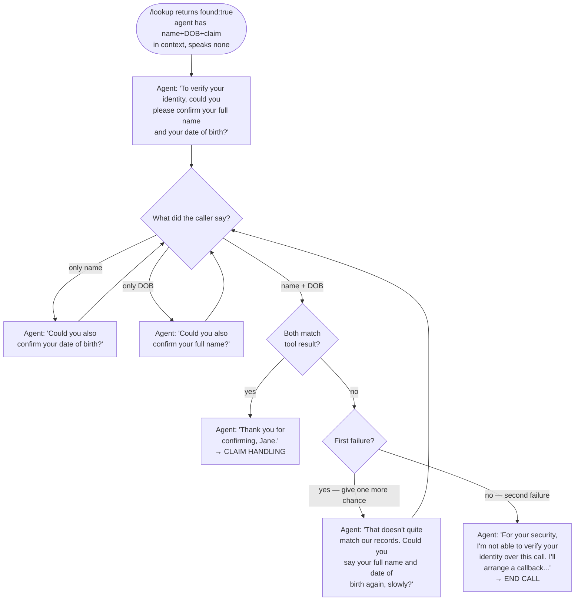
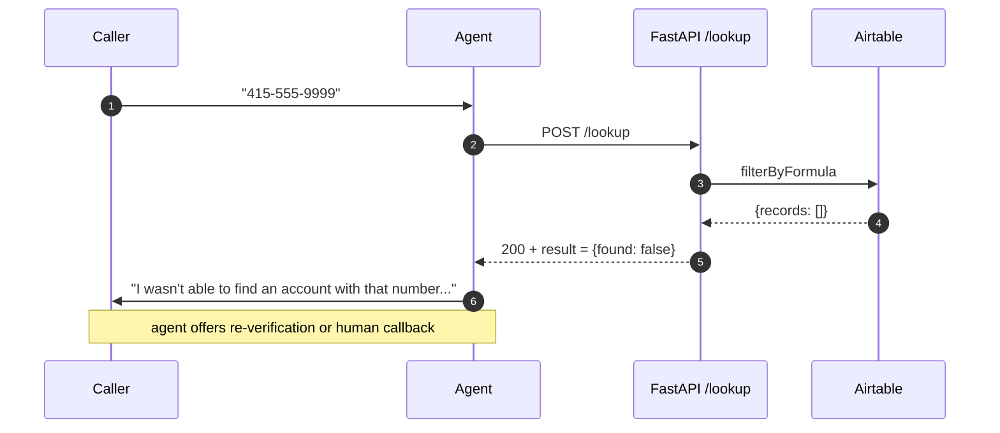

# Architecture

Every architectural element below maps to a specific file/line range in the repo. Citations like `api/services/analysis.py:28-103` are absolute and verifiable against the source.

## System overview

### Component → code map

| Element in diagram | Implemented in | Notes |
|---|---|---|
| **VAPI Native US Phone Number** | Configured in VAPI dashboard, not in code | Number assignment is a one-time UI step (`scripts/vapi_sync.py:239-240`) |
| **VAPI Voice Orchestrator** | Assistant config defined at `scripts/vapi_sync.py:101-170` | Synced to VAPI via REST API in `scripts/vapi_sync.py:218-241` |
| **Deepgram Nova-3 STT** | `scripts/vapi_sync.py:126-130` (`provider: "deepgram"`, `model: "nova-3"`) | Configured on the VAPI assistant |
| **GPT-4.1 Agent Brain** | `scripts/vapi_sync.py:109-115` (`provider: "openai"`, `model: "gpt-4.1"`, `temperature: 0.3`) | |
| **ElevenLabs Flash v2.5 TTS** | `scripts/vapi_sync.py:116-125` (`provider: "11labs"`, `model: "eleven_flash_v2_5"`, voiceId `21m00Tcm4TlvDq8ikWAM` = Rachel) | |
| **POST /lookup** (mid-call tool) | `api/routers/lookup.py:26-74` (the handler) | Request model: `VAPIToolCallRequest` (`api/models/tool_call.py:45-48`) |
| **POST /webhook** (live events + end-of-call) | `api/routers/webhook.py:23-51` | Request model: `VAPIWebhookPayload` (`api/models/webhook.py:58-61`) |
| **Post-call Pipeline (BackgroundTask)** | Scheduled at `api/routers/webhook.py:48` (`background_tasks.add_task(...)`); body at `api/services/analysis.py:28-103` | |
| **Transcript Analysis (GPT-4.1-mini)** | `api/services/analysis.py:106-116` — model literal at line 108 | Prompt loaded from `prompts/analysis_prompt.txt` via `api/utils/prompts.py:7-9` |
| **QA Scorer (GPT-4.1-mini)** | `api/services/qa_scorer.py:72-85` — model literal at line 75 | 9-item rubric at lines 17-63 |
| **Airtable callers + interactions** | Read: `api/services/airtable.py:29-44` (`get_caller_by_phone`) Write: `api/services/airtable.py:47-76` (`write_interaction`) | Models: `api/models/caller.py:10-39`, `api/models/interaction.py:10-28` |
| **Langfuse (per-call waterfall trace)** | All in `api/services/langfuse_client.py` — `trace_pipeline` (lines 132-151), `trace_lookup` (lines 154-176), `log_call_event` (lines 179-198) | Single trace ID derived per call at lines 91-92 |
| **Resend email alerts** | `api/services/email_alert.py:13-55` — fired from `api/services/analysis.py:87-102` | |

Legend: solid arrows = synchronous call/write; dotted arrows = observability or conditional alert. Every observation tagged with the same `session_id = call_id` collapses into one Langfuse trace per call (mechanism: OTel parent-context at `api/services/langfuse_client.py:103-110`).

## Infrastructure-as-Code: how the VAPI config gets to VAPI

| Step | Code |
|---|---|
| Read base prompt | `scripts/vapi_sync.py:51` (`PROMPT_PATH.read_text(...)`) |
| Concatenate KB markdown | `scripts/vapi_sync.py:46-61` (`assemble_system_prompt`) — iterates `KB_FILES` list at lines 38-43 |
| Build tool config | `scripts/vapi_sync.py:64-98` (`build_tool_config`) — `async: False` at line 72 |
| Build assistant config | `scripts/vapi_sync.py:101-170` (`build_assistant_config`) |
| Upsert tool (PATCH if name matches, else POST) | `scripts/vapi_sync.py:173-187` (`upsert_tool`); strips `type` on PATCH at line 179 |
| Upsert assistant | `scripts/vapi_sync.py:190-202` (`upsert_assistant`) |

Idempotent. Run it after every prompt change to push the new system prompt to VAPI.

## Happy-path call sequence

## Authentication sub-flow

Between steps 14–20 of the happy path above (`/lookup` returns → caller verified), the agent runs a two-factor knowledge challenge. Branching behavior:

The mismatch path does **not** reveal which factor was wrong (security). DOB parsing is fuzzy and handles spoken formats like "April fifteenth nineteen eighty-five", "4/15/85", "fifteenth of April 1985", and numeric "4 15 1985". For ambiguous month-day order ("06/05/2000"), assume US (June 5) unless caller says day-first.

Code references: `prompts/agent_system_prompt.txt` AUTHENTICATION FLOW section; `date_of_birth` model field at `api/models/caller.py:32-34`; returned by `/lookup` at `api/routers/lookup.py:115`; schema at `scripts/setup_airtable_schema.py` (`date_of_birth` field in `callers_schema`).

### Sequence → code map

| Step in diagram | Code |
|---|---|
| Webhook auth (each VAPI → H arrow) | `api/routers/webhook.py:29-33` calls `verify_vapi_secret` at `api/utils/auth.py:9-13` |
| Log event to Langfuse | `api/routers/webhook.py:38-39` calls `log_call_event` at `api/services/langfuse_client.py:179-198` |
| `POST /lookup` auth | `api/routers/lookup.py:31-35` |
| Phone normalize +14155550001 | `api/routers/lookup.py:83` calls `normalize_phone` at `api/utils/phone.py:9-28` |
| Airtable filterByFormula | `api/services/airtable.py:33-40` |
| `results[].result = JSON string` | `api/routers/lookup.py:54-57` — `json.dumps(result_dict)` at line 56 |
| Schedule background task | `api/routers/webhook.py:48` (`background_tasks.add_task(analysis.run_post_call_pipeline, event)`) |
| `extract_airtable_id` | `api/services/analysis.py:139-161` — walks `event.call.messages` reversed |
| `analyze_transcript` (GPT-4.1-mini) | `api/services/analysis.py:106-116` |
| `score_call` (GPT-4.1-mini) | `api/services/qa_scorer.py:72-85` |
| Write interaction row | `api/services/airtable.py:47-76` — `typecast: True` at line 73 |

## Error path — caller not found

The `/lookup` endpoint always returns 200 (`api/routers/lookup.py:74`). Per-call failures surface as `{"found": false, ...}` inside the `result` payload at these specific code paths:

| Failure | Source |
|---|---|
| Missing phone arg | `api/routers/lookup.py:78-80` |
| Invalid phone format | `api/routers/lookup.py:82-86` (catches `InvalidPhoneNumber` from `api/utils/phone.py:5-6, 26-28`) |
| Airtable unavailable | `api/routers/lookup.py:89-93` |
| Caller not found in Airtable | `api/routers/lookup.py:95-97` (returns `{"found": False}` only — no error field) |

The agent's branching prompt (`prompts/agent_system_prompt.txt`) checks the `found` and `error` fields and chooses the right response.

## Monitoring touchpoints

| Where | What is captured | Source |
|---|---|---|
| Railway logs | uvicorn access log + structured app logs at INFO | Logging config: `api/main.py:28-31`; per-module loggers at `api/routers/webhook.py:18`, `api/routers/lookup.py:21`, `api/services/analysis.py:25`, `api/services/langfuse_client.py:30` |
| Langfuse (one trace per call) | Live webhook events, `lookup_caller` span (input + output), post-call pipeline span with two child generations (analyze_transcript, qa_scoring) with input/output/model/latency/token usage | Trace creation: `api/services/langfuse_client.py:132-198`. Auto-instrumentation of OpenAI calls via `langfuse.openai.AsyncOpenAI` returned by `get_openai_client` at lines 76-88 |
| Airtable `interactions` | transcript, summary, sentiment, qa_score, qa_breakdown (JSON), topics_mentioned, escalated, caller link, langfuse_trace_url | Schema: `scripts/setup_airtable_schema.py`; write: `api/services/airtable.py:47-76`; model: `api/models/interaction.py:10-28` |
| Email alerts (Resend) | low-QA-score (< 0.6) or negative-sentiment calls — subject + HTML body include caller name, QA score, summary, Langfuse link | Trigger: `api/services/analysis.py:87-102`; send: `api/services/email_alert.py:13-55`; severity threshold (HIGH < 0.5) at `api/services/email_alert.py:10` |
| `scripts/inspect_call.py` | Manual diagnostic. Given a `call_id`, fetches `/call/{id}` from VAPI's REST API and dumps assistant config, message thread, every tool call with its actual result, and the transcript. | Lines 129-162 (`inspect`) |

## Failure modes and recovery

How the system behaves when VAPI, our backend, or an external service misbehaves. Each row names the failure, what actually happens today (with file:line citations), and what a production-hardening pass would add.

| Failure | What VAPI does | What our code does today | Production fix |
|---|---|---|---|
| `/lookup` takes longer than VAPI's tool timeout (default ~30s) | Marks the tool call as failed; the LLM sees an error in the tool message slot and improvises a response | We set `timeout=10.0` on the httpx client (`api/services/airtable.py:17`); typical lookup is <500ms. If Airtable is slow we return 200 with `{found: false, error: "lookup service unavailable"}` at `api/routers/lookup.py:89-93`, so the agent sees a clean miss and re-prompts the caller instead of getting a tool-timeout error | Already adequate; could add `httpx` retries with backoff for transient Airtable errors |
| `/lookup` returns a 5xx HTTP error | Treats non-2xx as a hard tool failure; aborts the call (depending on assistant config) | We **never return non-2xx for per-call errors** — every failure path returns 200 with structured `{found: false, error: "..."}` inside the result payload. Real 500s only happen on Python bugs and would be caught by uvicorn → Railway logs | OK as-is |
| `/webhook` unreachable when end-of-call fires | VAPI retries with exponential backoff (typically 3–5 attempts over a few minutes) | The post-call pipeline is **not idempotent** — if the first attempt succeeds and the response is dropped, a retry attempt will write a second interaction row in Airtable | Add a unique-key constraint on `call.id` in the Airtable `interactions` table and a pre-write check; or generate the Airtable record ID deterministically from `call.id` |
| `/webhook` malformed payload (Pydantic validation fails) | VAPI may retry depending on config | FastAPI returns 422 automatically via `VAPIWebhookPayload` validation at `api/routers/webhook.py:25`; no pipeline triggered | OK — payload shape is permissive (`extra="ignore"` at `api/models/webhook.py:18`), so this only fires on genuinely broken payloads |
| Mid-call VAPI outage (telephony goes down during a call) | Caller hears silence then disconnect; VAPI eventually emits `end-of-call-report` with `endedReason: "vapi-failure"` or similar | We process the report normally, but the transcript will be partial — `extract_transcript` at `api/services/analysis.py:125-136` returns whatever fragments are present. If transcript is empty, the pipeline aborts cleanly at `api/services/analysis.py:32-33` | Surface partial calls as a separate metric on the dashboard so they can be reviewed manually |
| Multiple concurrent calls | Each is a separate webhook hit | FastAPI on uvicorn handles concurrent requests via async event loop. The post-call pipeline is in-process (`BackgroundTask` at `api/routers/webhook.py:48`) — each call's pipeline runs independently in its own task | At ~100 concurrent calls Airtable's 5 req/sec/base rate limit becomes the first bottleneck. Migrate the data layer to Postgres (only `api/services/airtable.py` changes) and move pipeline execution to a Redis/RQ worker (function signature is already queueable) |
| Caller pauses mid-number ("415 555 ... 0001") | VAPI's default endpointing decides the turn is over after 0.5s of silence | We override at `scripts/vapi_sync.py:144-151` — `onNumberSeconds: 3.0`, `onNoPunctuationSeconds: 2.0`. Defensive prompt also handles incomplete numbers: if `/lookup` returns a digit-count error the agent re-prompts (AUTHENTICATION FLOW step 3a in `prompts/agent_system_prompt.txt`) | OK as-is |
| OpenAI rate-limit during post-call pipeline | n/a | `analyze_transcript` or `score_call` raises; the outer try/except at `api/services/analysis.py:60-62` logs with `logger.exception("pipeline: LLM step failed")` and aborts. No interaction row is written | Catch rate-limit specifically and write a partial row with just the transcript + `qa_score=None` so the call is logged even if scoring failed |
| Airtable write failure (5xx, schema mismatch) | n/a | Logged at `api/services/analysis.py:84-85`; pipeline continues to the email-alert step (so alerts still fire even when Airtable is having a bad day) | Add a small file-backed dead-letter queue (write failed interaction JSON to disk on Railway) — Railway storage is ephemeral but a process-lifetime queue catches transient failures |
| Email-send failure (Resend rate limit, network) | n/a | Logged at `api/services/analysis.py:101-102`; swallowed (alerts are best-effort) | Same dead-letter idea |
| Langfuse SDK error (network, init failure) | n/a | Suppressed via `contextlib.suppress(Exception)` in `_flush` and `_set_call_trace_metadata` at `api/services/langfuse_client.py:118-129`, plus outer try/except in `log_call_event` at lines 194-195. **Observability never breaks the call.** | OK as-is |
| VAPI tool call hits our /lookup before our app finishes cold-starting | Tool call times out | Railway containers stay warm under typical traffic; first request after a long idle pays ~2s spin-up. The lifespan validator at `api/main.py:34-43` warms the Langfuse client at boot to avoid first-request slowdown | Pre-warming on Railway via scheduled `/health` pings, or move to Fly.io / Render with always-on guarantees |

## Error capture points

| Boundary | Failure mode | Behavior | Source |
|---|---|---|---|
| `/webhook` | Missing/wrong `X-VAPI-Secret` | 401, no work done | `api/routers/webhook.py:29-33` |
| `/webhook` | Malformed payload (Pydantic validation) | 422, no work done | FastAPI automatic via `VAPIWebhookPayload` annotation at `api/routers/webhook.py:25` |
| `/webhook` | Unknown event type | 200 with `{"status": "logged", "type": ...}`, no pipeline triggered | `api/routers/webhook.py:51` (only `end-of-call-report` triggers pipeline at line 48) |
| `/lookup` | Missing/wrong `X-VAPI-Secret` | 401, no work done | `api/routers/lookup.py:31-35` |
| `/lookup` | Missing phone arg | 200 with `{found: false, error: "missing phone argument"}` | `api/routers/lookup.py:78-80` |
| `/lookup` | Invalid phone format | 200 with `{found: false, error: "expected a 10-digit..."}` | `api/routers/lookup.py:82-86` |
| `/lookup` | Airtable failure | 200 with `{found: false, error: "lookup service unavailable"}`; full exception logged via `logger.exception` | `api/routers/lookup.py:89-93` |
| Post-call pipeline | LLM call failure | logged with `logger.exception`, pipeline aborted (no partial Airtable write) | `api/services/analysis.py:60-62` |
| Post-call pipeline | Airtable write failure | logged, pipeline continues to email step | `api/services/analysis.py:84-85` |
| Post-call pipeline | Email send failure | logged, swallowed (alerts are best-effort) | `api/services/analysis.py:101-102` |
| Langfuse layer | Any SDK error | swallowed via `contextlib.suppress(Exception)` in `_flush` (lines 118-120) and `_set_call_trace_metadata` (lines 123-129); outer `try/except` in `log_call_event` (lines 194-195) | `api/services/langfuse_client.py` |
