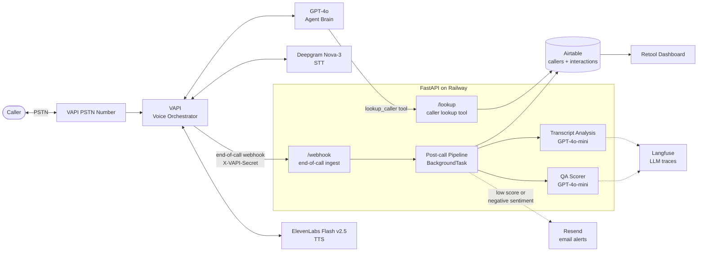
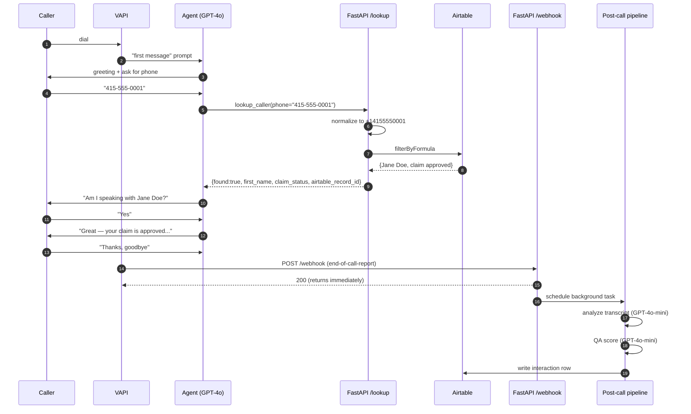
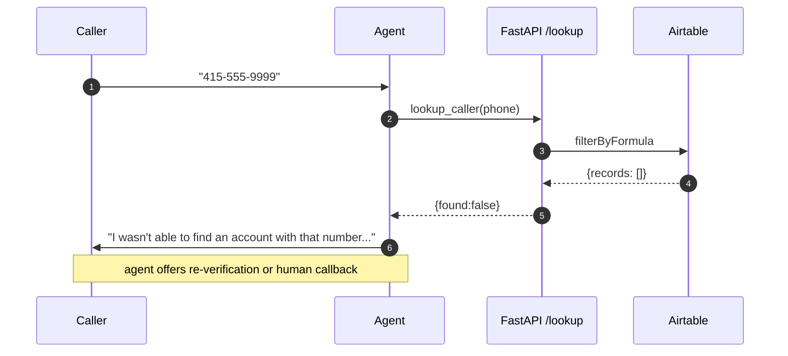

# Architecture

## System overview

Legend: solid arrows = synchronous call/write; dotted arrows = observability or conditional alert.

## Happy-path call sequence

## Error path — caller not found

## Monitoring touchpoints

| Where | What is captured |
|---|---|
| Railway logs | uvicorn access log, app-level structured logs, unhandled exceptions |
| Langfuse | every LLM call: input, output, latency, model, token count; grouped under a `post_call_pipeline` parent span per call |
| Airtable `interactions` | source of truth for every completed call — transcript, summary, sentiment, QA score, per-rubric breakdown |
| Email alerts (Resend) | low-score or negative-sentiment calls — includes deep-link to Langfuse trace |
| Retool dashboard | reads Airtable; surfaces containment rate, avg QA score, sentiment distribution, per-call drill-down |

## Error capture points

| Boundary | Failure mode | Behavior |
|---|---|---|
| `/webhook` | Missing/wrong `X-VAPI-Secret` | 401 returned, no work done |
| `/webhook` | Malformed payload | 422 returned, no work done |
| `/lookup` | Invalid phone format | 400 returned with reason |
| Post-call pipeline | LLM call failure | logged with `exception`, pipeline aborted, no partial Airtable write |
| Post-call pipeline | Airtable write failure | logged, pipeline continues to email step |
| Post-call pipeline | Email send failure | logged, swallowed (alerts are best-effort) |
